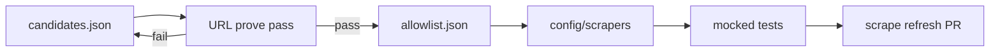

# Add companies to the catalog

Reusable playbook for expanding the allowlist and scraper set. Run this process whenever you want to grow the catalog — in a maintainer session, with an agent (“run `docs/ADD_COMPANIES.md`”), or by opening issues from each phase.

**Related:** [SCRAPER_CHECKLIST.md](SCRAPER_CHECKLIST.md), [config/allowlist.json](../config/allowlist.json), [config/candidates.json](../config/candidates.json)

## When to run

- After a batch of community suggestions or competitive research
- When parked companies may have new public program pages
- When you want **3–5 new allowlisted companies** (default batch size; override as needed)

## Inclusion bar

**Include** programs with a **public apply or join URL** (no login wall) for:

- Student ambassadors and campus reps
- Fellowships and branded student communities
- Campus clubs / student expert programs with an explicit join flow

**Exclude:**

- Generic internship or early-career job hubs without a named student program
- Pages that require authentication to view program details
- Sites that block automated fetches (e.g. persistent HTTP 403)

## Hard rules

1. Only allowlisted companies have scrapers in `config/scrapers/`.
2. One company per scraper PR; do not hand-edit `data/active/programs.json`. After scrapers land, run `make scrape` (or the daily refresh) so the published catalog actually includes the new companies.
3. Prove URLs before writing scrapers; maintainer approves the shortlist.
4. Program IDs are UUID v5 from `scripts/program_ids.py` — never hardcode arbitrary IDs.
5. Run `make lint test validate e2e` before merging.

## Flow

## Phase 1 — Re-audit candidates

Read [`config/candidates.json`](../config/candidates.json). For each parked company:

1. Find a canonical public program page under the inclusion bar.
2. Confirm HTTP accessibility without auth (manual or scripted HEAD/GET).
3. Record pass/fail, URL, program type, and date.

| Outcome | Action |
|---------|--------|
| **Pass** | Move entry to [`config/allowlist.json`](../config/allowlist.json); implement or fix scraper; add mocked tests |
| **Fail** | Update `block_reason` and `date` in candidates; delete any orphan `config/scrapers/<company>_scraper.py` |

## Phase 2 — Orphan scraper cleanup

After Phase 1:

- Registered scrapers must match allowlist companies (`test_comprehensive.py` → `test_scraper_matches_allowlist`).
- Remove scraper modules for companies that remain parked.
- Ship audit outcomes + cleanup in one focused PR (no catalog JSON edits).

## Phase 3 — Research shortlist (approval gate)

Propose **6–8** companies with **verified** URLs. Maintainer picks **3–5** to implement.

Use this table (copy into PR or issue):

| Company | Program name(s) | Canonical URL | Role type | Scrape notes | Passes bar? |
|---------|-------------------|---------------|-----------|--------------|-------------|
| | | | | static HTML / JS-heavy | yes / no |

Research heuristics:

- Campus/creator programs (Notion Campus Leaders, design-tool campus programs)
- Cloud/dev ecosystems (AWS, MongoDB, Red Hat-style ambassador or fellowship pages)
- Creative/productivity brands with fellowship or campus club apply flows

**Stop implementation until the shortlist is approved.**

## Phase 4 — Implement (one PR per company)

Follow [SCRAPER_CHECKLIST.md](SCRAPER_CHECKLIST.md):

1. Add entry to `config/allowlist.json`.
2. Create `config/scrapers/<company>_scraper.py` subclassing `EnhancedBaseScraper`.
3. Implement `find_program_urls()` and `parse_program_page(url)`.
4. Use `_fetch_page()` and `scraper_parse_utils`; class name `<Company>Scraper`.
5. Add mocked HTTP tests (no live network in CI).
6. Run `make lint test validate e2e`.
7. Open scraper-only PR; then run `python scripts/scrape_programs.py` (or wait for daily refresh) so `data/active/programs.json` includes the new programs. Allowlist scrapers do not appear in the catalog until a scrape runs.

Reference scrapers: `config/scrapers/adobe_scraper.py`, `config/scrapers/microsoft_scraper.py`, `config/scrapers/github_scraper.py`.

## Phase 5 — Hygiene

- Update `last_updated` / audit notes in allowlist and candidates JSON.
- Confirm this playbook still matches practice after the batch.
- Log promoted companies and any new candidates in PR descriptions.

## Re-run

Start a new batch anytime: re-read live allowlist and candidates, then walk Phases 1–5. Do not rely on stale snapshots from prior runs.

## Batch log

| Date | Promoted | Added | Still parked |
|------|----------|-------|--------------|
| 2026-08-08 | Google (GDG on Campus Lead) | IBM SkillsBuild, MongoDB for Students, Figma for Education, JetBrains Academy | Apple, Meta, Netflix, Spotify, Tesla |
| 2026-08-08 (run 2) | — | Canva for Education, Databricks Academy, Notion for Education, NVIDIA Training, Salesforce Student Program | Apple, Meta, Netflix, Spotify, Tesla |
| 2026-08-08 (run 3) | — | AMD University Program, Arm Education, Coursera for Campus, Elastic Training, Unity Education | Apple, Meta, Netflix, Spotify, Tesla |
| 2026-08-15 | — | Cengage Student Ambassador, Princess Polly College Ambassador, Red Bull Student Marketeer, UiPath Student Developer Champions, Wolfram Student Ambassador | Apple, Meta, Netflix, Spotify, Tesla |

Shortlist proven URLs used for 2026-08-15 batch:

| Company | Program | URL | Notes |
|---------|---------|-----|-------|
| Cengage | Student Ambassador Program | https://www.cengage.com/student/ambassador/ | Paid North American undergraduate ambassador role with public application link |
| Princess Polly | College Ambassador Program | https://us.princesspolly.com/pages/college-ambassador | 2026-27 U.S. college creator program with direct application |
| Red Bull | Student Marketeer | https://jobs.redbull.com/us-en/microsite/student-marketeer?lang=en | Paid campus representative role with live North American student-job search |
| UiPath | Student Developer Champions | https://community.uipath.com/uipath-student-developers-program/ | University student leader program with direct application form |
| Wolfram Research | Student Ambassador Initiative | https://www.wolfram.com/company/careers/ambassador/ | Worldwide student ambassador program with active apply route |

Shortlist proven URLs used for 2026-08-08 batch (run 3):

| Company | Program | URL | Notes |
|---------|---------|-----|-------|
| AMD | University Program | https://www.amd.com/en/corporate/university-program.html | Educator/student resource hub |
| Arm | Arm Education | https://www.arm.com/resources/education | Student/educator learning resources |
| Coursera | Coursera for Campus | https://www.coursera.org/campus | University online learning program |
| Elastic | Elastic Training | https://www.elastic.co/training | Training and certification hub |
| Unity | Unity Education | https://unity.com/solutions/education | Student 3D education program |

Shortlist proven URLs used for 2026-08-08 batch (run 2):

| Company | Program | URL | Notes |
|---------|---------|-----|-------|
| Canva | Canva for Education | https://www.canva.com/education/ | Education hub with sign-up |
| Databricks | Databricks Academy | https://www.databricks.com/learn/training/home | Training home page |
| Notion | Notion for Education | https://www.notion.com/help/notion-for-education | Help hub with campus leader refs |
| NVIDIA | NVIDIA Training | https://www.nvidia.com/en-us/training/ | Student training resources |
| Salesforce | Student Program | https://trailhead.salesforce.com/help?article=Student-Program | Trailhead help article |

Shortlist proven URLs used for 2026-08-08 batch (run 1):

| Company | Program | URL | Notes |
|---------|---------|-----|-------|
| Google | GDG on Campus Lead | https://developers.google.com/community | Static HTML; campus/leader content |
| IBM | SkillsBuild University Students | https://skillsbuild.org/university/students | Sign-up landing page |
| MongoDB | MongoDB for Students | https://www.mongodb.com/students | Student Pack benefits |
| Figma | Figma for Education | https://www.figma.com/education/higher-education/ | Student verification flow |
| JetBrains | JetBrains Academy | https://www.jetbrains.com/academy/ | Student learning paths |

## Out of scope

- Hand-editing catalog JSON in scraper PRs
- Internship-only career hubs
- Schema or program-ID changes without a migration plan
- Implementing scrapers before shortlist approval
